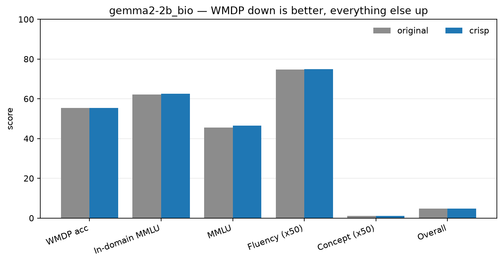
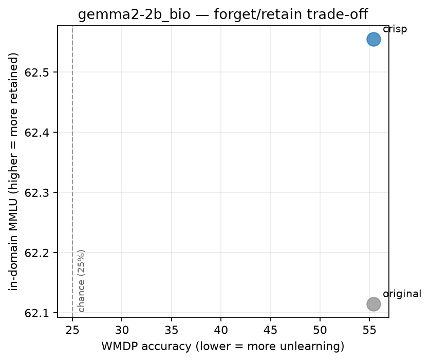
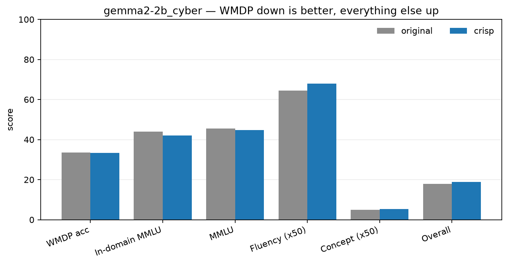
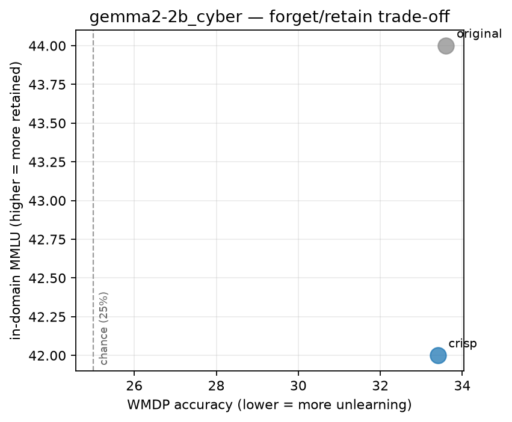
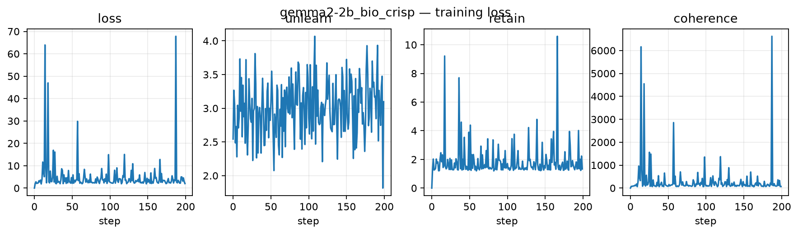
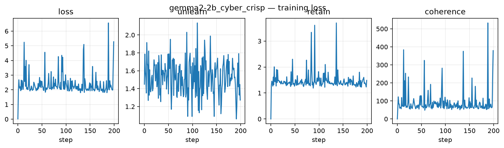

# Figures

Regenerate with `python -m crisp plots` after any new evaluation.

### metrics_gemma2-2b_bio

### tradeoff_gemma2-2b_bio

### metrics_gemma2-2b_cyber

### tradeoff_gemma2-2b_cyber

### training_gemma2-2b_bio_crisp

### training_gemma2-2b_cyber_crisp

